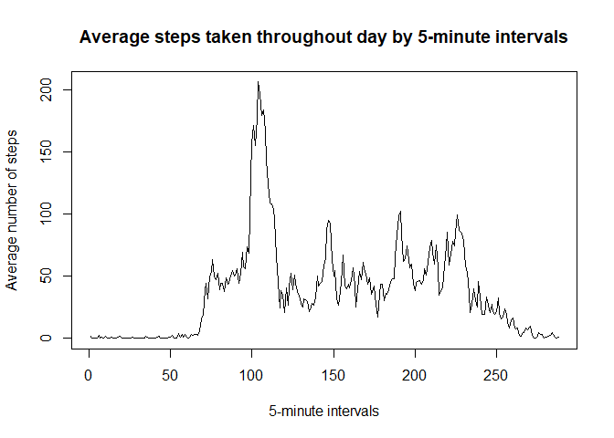
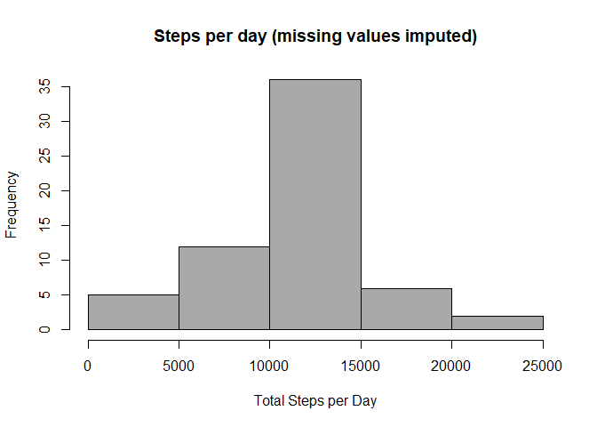
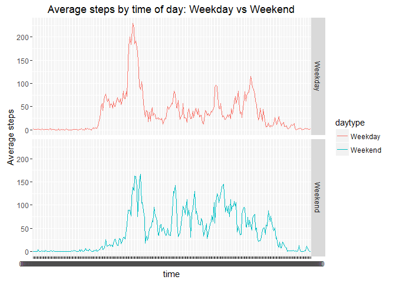

# Reproducible Research - Course Project 1
Matt Hawkins  
29 October 2017  


##Introduction

This is the R Markdown file for Course Project 1 of the Reproducible Research Coursera course. I sincerely hope that you enjoy this experience.

##Loading and preprocessing the data

Show any code that is needed to

1. Load the data (i.e. read.csv())
2. Process/transform the data (if necessary) into a format suitable for your analysis


```r
#Read Data
setwd("~/Coursera/DataScience/5_Reproducible/week2/RepData_PeerAssessment1")
activity <- read.csv("activity.csv")

#Convert Interval column to H:M:S format
mins <- as.vector(activity$interval)
mins <- sprintf("%04d00", mins)
mins <- format(strptime(mins, format = "%H%M%S"), format = "%H:%M:%S")

#Bind date and time
date <- as.vector(activity$date)
date <- format(strptime(date, format = "%Y-%m-%d"), format = "%Y-%m-%d")
dateTime <- as.data.frame(as.POSIXct(paste(date, mins), format = "%Y-%m-%d %H:%M:%S"))

#Recreate data frame with four columns: steps, datetime, date and time; clean up intermediary vectors & dataframe
date <- as.data.frame(date)
time <- as.data.frame(mins)
activity <- cbind(activity$steps,dateTime, date, time)
colnames(activity) <- c("steps", "datetime", "date", "time")
rm(dateTime, mins, date, time)
```

**No output needed here, but you now have a shiny new dataset with number of steps in each interval, using different datetime formats for easier manipulation later.**

##What is mean total number of steps taken per day?

For this part of the assignment, you can ignore the missing values in the dataset.

1. Calculate the total number of steps taken per day
2. If you do not understand the difference between a histogram and a barplot, research the difference between them. Make a histogram of the total number of steps taken each day
3. Calculate and report the mean and median of the total number of steps taken per day


```r
#Calculate sum of steps per day
stepsPerDay <- with(activity,tapply(steps,date,sum))

#Draw histogram of frequency of steps per day
hist(stepsPerDay, main = "Histogram: Total Steps per Day", xlab = "Total Steps per Day", col = "light grey")
```

<!-- -->

```r
#Calculate mean and median steps per day
mean(stepsPerDay, na.rm = TRUE)
```

```
## [1] 10766.19
```

```r
median(stepsPerDay, na.rm = TRUE)
```

```
## [1] 10765
```

##What is the average daily activity pattern?

1. Make a time series plot (i.e. type = "l") of the 5-minute interval (x-axis) and the average number of steps taken, averaged across all days (y-axis)
2. Which 5-minute interval, on average across all the days in the dataset, contains the maximum number of steps?


```r
#Calculate average steps taken during each 5-minute interval
stepsPerTime <- with(activity,tapply(steps,time,mean, na.rm=TRUE))

#Plot line graph of steps across day
plot(stepsPerTime, type = "l", xlab = "5-minute intervals", ylab = "Average number of steps", 
     main = "Average steps taken throughout day by 5-minute intervals")
```

<!-- -->

```r
#Check for dependent package
if("nnet" %in% rownames(installed.packages()) == FALSE) {
  install.packages("nnet")
  }
library(nnet)

#Return 5-minute interval with highest average number of steps
which.is.max(stepsPerTime)
```

```
## [1] 104
```

**Because I have not used the standard interval labels (where each element is a multiple of 5), my 104 corresponds to 520 in the raw data set.**

##Imputing missing values

Note that there are a number of days/intervals where there are missing values (coded as NA). The presence of missing days may introduce bias into some calculations or summaries of the data.

1. Calculate and report the total number of missing values in the dataset (i.e. the total number of rows with NAs)
2. Devise a strategy for filling in all of the missing values in the dataset. The strategy does not need to be sophisticated. For example, you could use the mean/median for that day, or the mean for that 5-minute interval, etc.
3. Create a new dataset that is equal to the original dataset but with the missing data filled in.
4. Make a histogram of the total number of steps taken each day and Calculate and report the mean and median total number of steps taken per day. Do these values differ from the estimates from the first part of the assignment? What is the impact of imputing missing data on the estimates of the total daily number of steps?


```r
#Calculate total NAs in dataset
sum(is.na(activity$steps))
```

```
## [1] 2304
```

```r
#Impute missing values based on avg steps in interval on days with complete measurements, rounding to nearest integer
avgTime <- cbind(unique(activity$time),as.data.frame(stepsPerTime))
colnames(avgTime) <- c("time","avgsteps")
activityAvgs <- merge(activity, avgTime, by = "time")
activityAvgs$stepsImp <- ifelse(is.na(activityAvgs$steps), round(activityAvgs$avgsteps, digits = 0), activityAvgs$steps)

#New dataframes containing imputed values
activityImp <- merge(activity, activityAvgs, by = "datetime")
activityImp <- activityImp[, c(1,3,4,9)]
colnames(activityImp) <- c("datetime", "date", "time", "steps")

#Calculate sum of steps per day
stepsPerDayImp <- with(activityImp,tapply(steps,date,sum))

hist(stepsPerDayImp, col = "dark grey", xlab = "Total Steps per Day", main = "Steps per day (missing values imputed)")
```

<!-- -->

```r
mean(stepsPerDayImp)
```

```
## [1] 10765.64
```

```r
median(stepsPerDayImp)
```

```
## [1] 10762
```

**I took the approach of calculating the average steps per interval across all days with complete values, rounded each of these averages to the nearest integer and used these in cases where data was missing from the raw data set. The mean and median values do differ slightly from the original values, likely because there is an inconsistent weighting of different weekdays with complete/missing values in the raw data set, so the imputed values may be based on days with higher/lower number of steps than average. The instructions did not call for a sophisticated method :)**

##Are there differences in activity patterns between weekdays and weekends?

For this part the weekdays() function may be of some help here. Use the dataset with the filled-in missing values for this part.

1. Create a new factor variable in the dataset with two levels - "weekday" and "weekend" indicating whether a given date is a weekday or weekend day.
2. Make a panel plot containing a time series plot (i.e. type = "l") of the 5-minute interval (x-axis) and the average number of steps taken, averaged across all weekday days or weekend days (y-axis). See the README file in the GitHub repository to see an example of what this plot should look like using simulated data.


```r
#Create column to determine if weekday or weekend
activityImp$daytype <- as.factor(ifelse(weekdays(activityImp$datetime) %in% c("Saturday", "Sunday"), "Weekend", "Weekday"))

#Check for dependent package
if("ggplot2" %in% rownames(installed.packages()) == FALSE) {
  install.packages("ggplot2")
}
library(ggplot2)

#Calculate avg steps per interval for weekday vs weekends
activityWD <- aggregate(activityImp$steps, by = list(activityImp$daytype, activityImp$time), FUN = mean)
colnames(activityWD) <- c("daytype", "time", "steps")

#Panel plot with time series
ggplot(activityWD, aes(x = time, y = steps, color = daytype, group = 1))+
  geom_line()+
  labs(title = "Average steps by time of day: Weekday vs Weekend", x = "time", y = "Average steps")+
  facet_grid(daytype~.)
```

<!-- -->

**There does appear to be a difference in pattern between weekdays and weekends. The late-morning peak is considerably higher on weekdays, while the distribution of peaks across weekends is much more even.**
